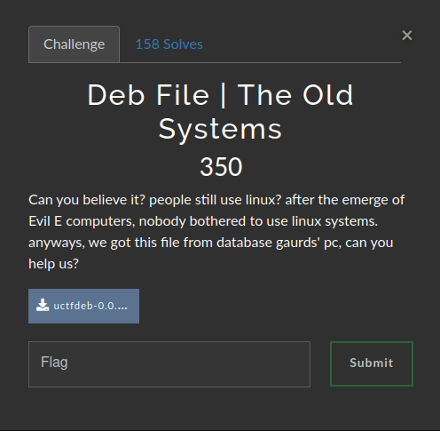

# Deb File | The Old Systems

### Challenge:
##### Can you believe it? people still use linux? after the emerge of Evil E computers, nobody bothered to use linux systems. anyways, we got this file from database gaurds' pc, can you help us?

##### FIles: [uctfdeb-0.0.1.deb](uctfdeb-0.0.1.deb)

### Solution:
Firstly i ran ```$ sudo dpkg -i uctfdeb-0.0.1.deb```,
after installing the package i found the bash script [uctf](uctf).

```bash
#!/usr/bin/env bash

if [ -f /tmp/UCTFDEB/dont-delete-me ]; then
	FLAG=`cat /tmp/UCTFDEB/dont-delete-me`
	if ! command -v curl > /dev/null; then
		echo 'Install curl and try again'
		exit 1
	else
		curl 127.0.0.1:7327 --header "flag: $FLAG"
	fi
else
	echo '404, there is no flag to be found'
    exit 1
fi
```

After understanding what the script does it becomes just a simple matter of reading the flag:

```bash
$ cat /tmp/UCTFDEB/dont-delete-me
UCTF{c4n_p3n6u1n5_5urv1v3_1n_54l7_w473r}
```

Flag: ```UCTF{c4n_p3n6u1n5_5urv1v3_1n_54l7_w473r}```

Extra: After solving the challenge you can remove the package with ```$ sudo dpkg -i uctfdeb-0.0.1.deb```.
