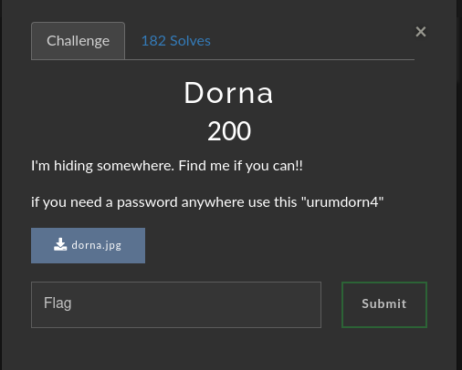

# Dorna

### Challenge:
##### I'm hiding somewhere. Find me if you can!!
##### if you need a password anywhere use this "urumdorn4"
##### Files: [dorna.jpg](dorna.jpg)

### Solution:
This being a steganography challenge and them giving us a password to use heavily hints to the use of [steghide](https://github.com/StefanoDeVuono/steghide).
If we try to use steghide on the image with the provided password we can extract this [file](dorn4.txt)

```bash
$ steghide extract -sf dorna.jpg
Enter passphrase: 
wrote extracted data to "dorn4.txt".
$ cat dorn4.txt 
Hello, wish you success in our event

'dorna lar yovasi' is the nickname of a stadium in Urmia where volleyball lovers gather together.
This place has hosted important competitions such as the VNL and the Asian Championship.

flag : uctf{ZG9ybmFfbGFyX3lvdmFzaQ==}    *base64-encoded
```

By decoding the base64 string we can get our flag

Flag: ```uctf{dorna_lar_yovasi}```
