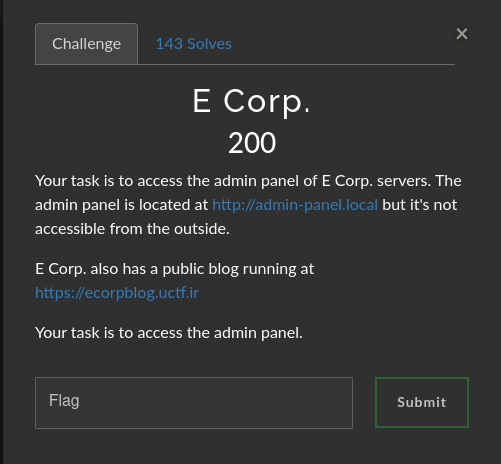

# E corp.

### Challenge:
##### Your task is to access the admin panel of E Corp. servers. The admin panel is located at http://admin-panel.local but it's not accessible from the outside.

##### E Corp. also has a public blog running at https://ecorpblog.uctf.ir

##### Your task is to access the admin panel.

##### Links: [http://admin-panel.local](http://admin-panel.local), [https://ecorpblog.uctf.ir](https://ecorpblog.uctf.ir)

### Solution:
By inspecting the javascript code of the blog we can find out how it requests posts from the api, by using this knowledge we can request the admin panel as a post using the api, which will give us our flag.

```{"status":"success","post":"uctf{4z174_1n_urm14}"}```

Flag: ```uctf{4z174_1n_urm14}```