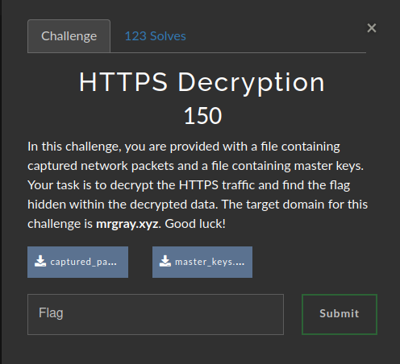
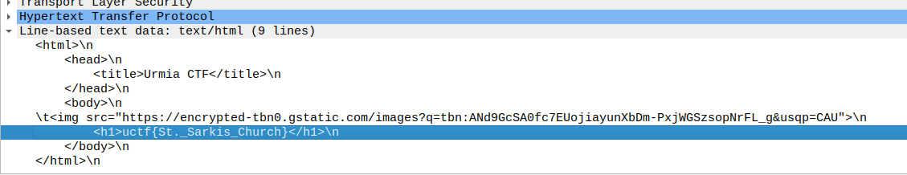

# HTTPS Decryption

### Challenge:
##### In this challenge, you are provided with a file containing captured network packets and a file containing master keys. Your task is to decrypt the HTTPS traffic and find the flag hidden within the decrypted data. The target domain for this challenge is mrgray.xyz. Good luck!
##### FIles: [captured_packets.pcapng](captured_packets.pcapng), [master_keys.log](master_keys.log)

### Solution:
We can decrypt the traffic using wireshark by going into ```Edit > Preferences > Protocols > TLS``` and using the provided keys.
Once we have decrypted the traffic we can search the domain ```mrgray.xyz``` as hinted by the challenge description.



Flag: ```uctf{St._Sarkis_Church}```