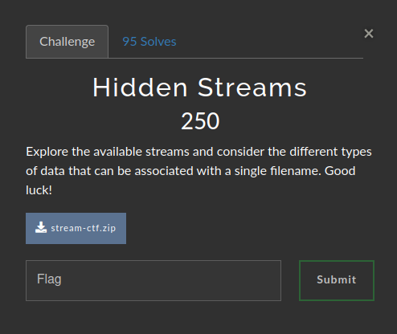
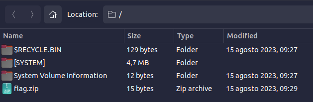

# Hidden Streams 

### Challenge:
##### Explore the available streams and consider the different types of data that can be associated with a single filename. Good luck!
##### FIles: [stream-ctf.zip](stream-ctf.zip)

### Solution:
The challenge provided us with a vhd (virtual hard disk) file inside an archive, the first thing i did was running strings on the file which gave us something interesting

```
password:Atoosa
uctf_flag.txt
```
Then i decided to dig into the file by converting it to a .zip archive. It's probably not the best nor the most elegant way but it worked for me.



The flag.zip file seemingly just contains the plain text "password:Atoosa" but by extracting it from the archive we can obtain an additional file, [flag.zip:lookbehind](flag.zip:lookbehind), which is a password protected zip that contains the previously mentioned uctf_flag.txt, by using the password "Atoosa" we can extract the txt and get our flag.

Flag: ```uctf{St. Mary Church}```

Extra: I actually managed to find the bytes of the password protected zip by using grep on the system files of the vhd, more specifically i extracted the bytes from the $MFT file in the \[SYSTEM\] folder, this challenge was very cool but i fear a lot of things flew over my head.