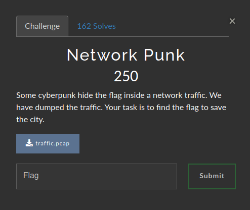
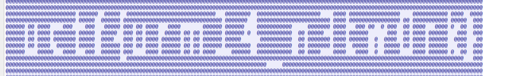

# Network Punk

### Challenge:
##### Some cyberpunk hide the flag inside a network traffic. We have dumped the traffic. Your task is to find the flag to save the city.
##### FIles: [traffic.pcap](traffic.pcap)

### Solution:
As with all network challenges i tried the low hanging fruit: searching "flag".
And that gave me the tcp stream with the flag



Flag: ```uctf{urm14_n3tw0rk}```