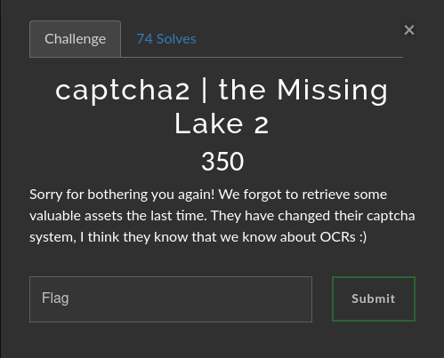

# Captcha2 | the Missing Lake 2

### Challenge:
##### Sorry for bothering you again! We forgot to retrieve some valuable assets the last time. They have changed their captcha system, I think they know that we know about OCRs :)

##### Link: [https://captcha2.uctf.ir/](https://captcha2.uctf.ir/)

### Solution:
We need to make a script to complete 100 captchas in order to get the flag.
We can notice how the filename of the images of the various animals are constant, knowing this we can simply make a dictionary that binds every animal to its filename.

After answering successfully to 100 captchas we can get our flag:
Flag: ```UCTF{Arm3n1an_m0uflon}```

